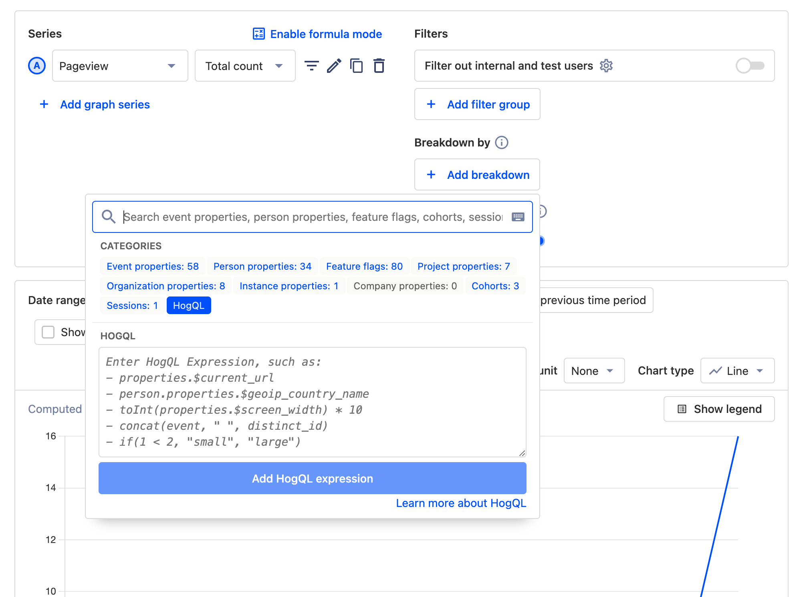
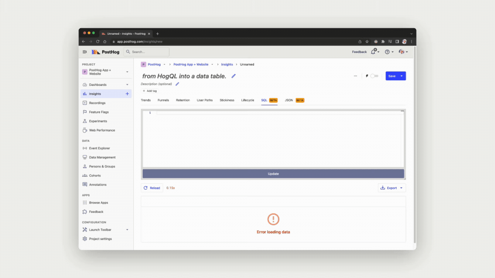

Today, we're excited to announce a major new feature which we're making available to all users as a public beta on PostHog Cloud - the ability directly access data stored in PostHog via SQL. 

We've added several new ways to use SQL in PostHog - you can use expressions to enhance insights, you can use SQL to filter a revamped events list, and you can even use full SQL queries to analyse data in any way you want. We've even created our own SQL dialect just for PostHog, called HogQL. 

We think that PostHog's existing insights will remain valuable for the vast majority of queries, but this update gives them a massive upgrade, and the ability to create your own SQL queries provides an alternative when off-the-shelf insights don't fit the bill. 

Speaking of bills, these features are free for all users while in public beta - all we ask is that you share any feedback you have with it either via the PostHog Slack, or by [filing an issue on our repo](https://github.com/PostHog/).

## What is HogQL?
HogQL is basically our take on SQL. 

Less basically, it's a transition layer over ClickHouse SQL that we've created to empower a wide range of users, from technical product managers who need multi-property breakdowns, to engineers who need to dissect data in more nuanced ways. It's intuitive for teams who are familiar with SQL, but offers a few extra advantages and features.

Unique features to HogQL include simplified access to event and person properties, as well as automatically added joins when you query fields with data on a different table, such as `events.person.properties.$browser`.

You can also use aggregations, such as `count`, `min`, `minIf`, `max`, `maxIf`, `sum`, `sumIf`, `avg`, `any`, and `anyIf`. 

We recommend checking the docs for a more detailed [explanation of ClickHouse SQL functions which are supported in HogQL](/manual/hogql).

You don't have to use HogQL. If you prefer vanilla SQL, we've added a new SQL insight type just for that. 

## HogQL expressions


A frequent request from teams using PostHog has been the ability to breakdown insight results across multiple properties. To accommodate this, we've added the ability to use HogQL expressions within an insight breakdown - so, in other words, you can now breakdown results however you like. 

HogQL expressions in insights combines the speed of PostHog's existing insights with the flexibility of HogQL - so you can do things such as plotting the signup sources by email domain, or breaking down signups by both pricing tier and overall usage.

## SQL insights


If you're familiar with SQL, the easiest and most powerful way to leverage it within PostHog is via the new SQL insight type. This gives you direct SQL access to your data in PostHog, so you can create custom tables, visualization and more. 

SQL insights are especially useful for when you need to do exotic or novel analysis that isn't immediately possible with existing insight types. For example, while you can use a retention insight to discover which product features keep users coming back for more, you could use an SQL insight to find which users keep coming back and identify outliers. 

We're incredibly excited to hear your feedback and see what's possible with SQL access in PostHog, and believe it will give engineers a unique edge and better information than they'd be able to get with other product analytics tools.

To give you a sense of what's possible with SQL, here's an example query we use to summarize data from our from [our 404 page](/hedgehogsgalore) and display which countries prefer their pizzas with pineapple on them.

```
{
  "kind": "DataTableNode",
  "full": true,
  "source": {
    "kind": "EventsQuery",
    "select": [
      "properties.$geoip_country_name",
      "if(countIf(properties.does_pineapple_go_on_pizza == 'false') > countIf(properties.does_pineapple_go_on_pizza == 'true'), '🍅 Does not belong on pizza', if(countIf(properties.does_pineapple_go_on_pizza == 'false') == countIf(properties.does_pineapple_go_on_pizza == 'true'), '🥦 It is a tie' , '🍍 Belongs on pizza')) -- Result",
      "concat(repeat('🍍', countIf(properties.does_pineapple_go_on_pizza == 'true')),repeat('🍅', countIf(properties.does_pineapple_go_on_pizza == 'false'))) -- Answers",
      "count() -- Number of answers",
      "concat(toString(round(countIf(properties.does_pineapple_go_on_pizza == 'true') / count() * 1000) / 10), '%') -- Percentage pineapple"
    ],
    "after": "-365d",
    "limit": 100,
    "event": "pineapple_on_pizza_survey",
    "orderBy": [
      "-count() # Number of answers"
    ],
    "before": ""
  },
  "propertiesViaUrl": true
}
```

## Custom insights
The final new insight type is called Custom insights. Like the SQL insight type, custom insights enable you to create a very wide range of insights and visualizations (but using JSON instead). What makes custom insights special is that you can embed any table you create directly into a dashboard - complete with any filters and custom columns you want. 

## The PostHog event explorer 
In addition to introducing HogQL, we've also upgraded the event explorer (previously known as the Live events tab) to give you more ways to filter events and analyze your data.

Unlike the old "Live events" view, the event explorer lets you use HogQL expressions (`properties.$screen_width * $properties.screen_height`) and aggregations (`sum(properties.price)`) as columns.

The event explorer also lets you view and edit the JSON source behind the table. We've also added the ability to add custom columns and filter them using HogQL. This is helpful not just for generating tables which summarize person and event information according to your needs, but also for exploring the data in new and totally custom ways. You could, for example, use HogQL to run currency conversions and normalize data into a single currency in its own column - or even extrapolate and project revenue and usage figures into the future.

## The history and future of HogQL

We originally started thinking about HogQL back in January, while thinking about [a concept for universal search within PostHog](https://github.com/PostHog/posthog/issues/7963). Over time, that plan evolved into creating [new ways for users to explore data](https://github.com/PostHog/meta/issues/86) via direct queries. We wanted users to be able to run formulas powered by HogQL in what was then called the Live Events view, but is now the Event Explorer. 

However, while this work was underway we realized we could potentially take it a step further and build full SQL support directly into PostHog as a new insight type. You'd simply write a new SQL query in PostHog, press 'Run' and get a table with your desired results. 

We're still actively developing these ideas, as well as the implementation of HogQL within PostHog. If you have any feedback, we'd love to here from you in [the PostHog Slack group](/slack).

<ArrayCTA />
