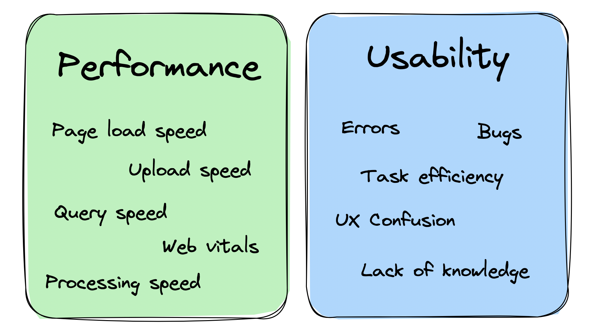
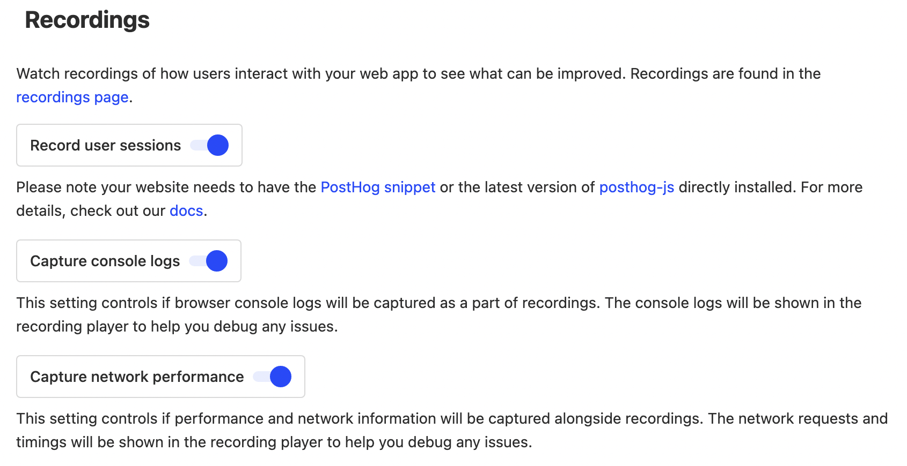
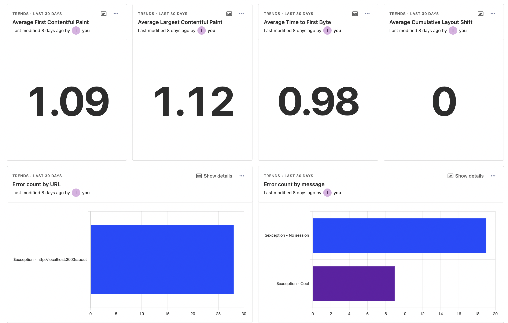

Before anyone can use your product, you must make sure it actually works. Figuring this out is more tricky than just running it locally. Changes often have unintended consequences on other parts of the app or create non-obvious issues. To track and prevent this, companies rely on monitoring.

There are a couple of ways to do monitoring. The first is synthetic monitoring which relies on  simulated behaviors and software tests. The second way, which we cover in this post, is real user monitoring. This is relying on the behavior of real users to ensure your product is working as intended. 

## Real user monitoring in detail

Real user monitoring is tracking the usage, performance, and quality of your product based on how users are experiencing it. It is different from synthetic monitoring which tracks similar metrics but with tests and simulations. 

Because of this difference, real user monitoring is a closer representation of reality. It identifies real issues, largely broken down into two classes:

- Performance: loading, page, and query speed
- Usability: errors, confusion, bugs

The ideal real user monitoring system identifies these problems, figures out their details, supports improvement prioritization, and ultimately, creates a better overall user experience.

## Why do real user monitoring?

Real user monitoring is important because it helps you understand your current user experience, discover ways to improve it, and manage the risk of future issues.

### 1. Understand current experience

The first reason to do real user monitoring is to ensure your product performs well. Providing a quality experience matters. To make this happen, you must have visibility into what the current experience is like for users.

This means understanding query performance, core web vitals, front and backend error rates, usage challenges, and more. These impact a user’s ability to accomplish their goals with your product. Issues doing this create a negative experience that hurts your business overall.

Understanding and maintaining a high-quality user experience is critical to creating a successful product. Real user monitoring creates visibility into the user experience.

### 2. Improve experience

There are always endless potential improvements to your product. Each of them (hopefully) creates some amount of positive impact on users’ experience. To get the largest impact on what you build, real user monitoring captures metrics to help prioritize these improvements. For example:

- A slow query might not matter for a free user but might be a top priority for a large potential customer in a trial stage.
- Multiple users complain about slow queries, but you don’t know which ones or how slow they are without some tracking on them.
- A user complains a feature "sucks," but you don’t know what this means. It could mean slow page speed, poor design, a bug, or a lack of knowledge.

Real user monitoring helps you get the information to understand and prioritize the issues impacting user experience, whether it is query speeds or session replays. Often, this data is key to solving the issue.

### 3. Manage risk

The third and final reason to do real user monitoring is it helps manage risk. It does this by identifying issues and enabling plans to limit them. It enables companies to make promises about their experience quality, and back those promises with data.

Using software comes with risks. For example, a payment processor being down could lead to millions in lost revenue for companies relying on it. Having monitoring in place helps limit these risks proactively. When working with larger companies, risk management is critical.

Companies want to know the products they use have high uptime, and won’t be slow or buggy. This is often solidified in a service-level agreement, or SLA, which is a contract defining the expected service levels an application must provide (such as uptime and performance). Real user monitoring measures metrics important to SLAs, helping companies conform to them.

Real user monitoring creates trust, which is both useful for internal predictions and external promises.

## How to setup real user monitoring with PostHog

With a knowledge of what real user monitoring is and why it is important, we can show you how to set it up for yourself. Setup happens over three stages: capture, analyze, and action. PostHog has the tools to do all three.

### 1. Capture

To setup real user monitoring in PostHog, we rely on session replays and custom event capture. 

Session replays capture exactly how users are interacting with your app. They also include errors, console logs, and performance measurements. To enable session replays, initialize a `posthog-js` client or add the [snippet](/docs/getting-started/install?tab=snippet) to your site and make sure to enable the options related to "Recordings" in your [project settings](https://app.posthog.com/project/settings#recordings).

To capture errors, query speed, aggregate performance metrics, and any other events, you can capture custom events using one of our [SDKs](/docs/libraries/js) or with our [API](/docs/api/post-only-endpoints). Alternatively, for error capture, you can use our [Sentry integration](/docs/libraries/sentry). 

### 2. Analyze

Once you’ve begun to capture data, you can start to analyze it. This helps you identify usability and performance issues in your product. You can [create insights](https://app.posthog.com/insights/new), and add them to a monitoring [dashboard](/docs/product-analytics/dashboards). Some insights you might want to add to your dashboard include:

- Errors broken down by page, group, or user.
- Average or p95 page load speed broken down by page.
- Average or p95 query speed broken down by query.
- Rageclicks broken down by page.
- User path to errors.

For each of these insights, you can use session replays to dive deeper into exactly what is happening in the related sessions. Just click the visualization to get a list of users and their replays. In those replays, you can see where events like errors or queries happen, console logs, and performance details for that specific session. 

The combination of these enables you to understand your current experience, understand what areas need improvement, and monitor the quality of the service you are providing.

### 3. Action

Once you’ve set up capture and analysis, it is important to take action on the monitoring. There are two key ways of doing this: feature development and business processes.

Your monitoring can inform what you are working on. It can help you understand the issues hurting user experience the most, errors happening most often, and slow queries impacting the most users. Understanding the full landscape of your product’s user experience enables you to prioritize each of these. 

For example, breaking your insights down by page enable you to see what pages have the highest amount of errors. You can then work to fix errors on that page to improve users’ experience with it. Session replays enable you to figure this out quickly. 

Real user monitoring can also integrate with your business processes. Providing a high-quality experience doesn’t just mean the product you create, but also the interactions you have with your users. 

For example, you can use actions to send notifications to webhooks on errors. You can then use these webhooks to send details to the places your team spends time in like Slack or Teams. In PostHog’s case, we’ve used this to send us a notification in Slack when someone navigates to a page that doesn’t exist and gets a 404. This helps us fix these links and provide a better user experience.

## Further reading

- [The most useful product health metrics](/blog/product-health-metrics)
- [Retention rate vs churn rate: An intro to churn analysis](/blog/churn-rate-vs-retention-rate)
- [How to improve web app performance using PostHog session replays](/tutorials/performance-metrics)